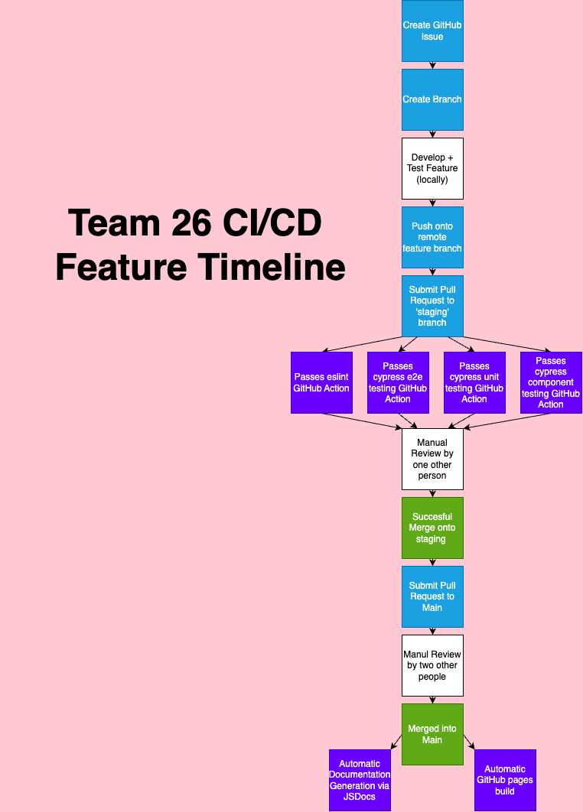

# Team 26 Phase 1 CI/CD Plan

Team 26 plans to heavily incorporate CI/CD and other DevOps related measures to streamline our build and ensure that errors do not make their way into production. We do this by adhering to strict conventions and ensuring uniformity and simplicity as much as possible. 

## Basic Git Structure
First, we have a Git structure as follows:

There is the main branch which contains the production code. There is also a staging branch, where we ensure that recent merges do not do anything unexpected. Apart from that, all features or other additions to the project are done in short lived feature branches. There may be more long term branches as well for certain subteams or more complex features, but this is the general idea.

Development branches are to be named in the form of:
- 'feature/feature-name'
- 'bug/bug-name'
- 'documentation/documentation-name'
- 'devops/devops-name'
- 'testing/testing-name' 

We also have conventions on git commit messages with a custom template. Finally, we plan to take advantage of GitHub release events + tags.

## CI/CD
We incorporate usages of CI/CD in numerous places throughout our pipeline. For one, we employ a comprehensive testing suite through cypress which offers unit, component, and e2e testing. We also include eslint to ensure that easy mistakes are missed. Also, many warnings are treated as errors.

## Human Review

We also make sure to include many safe points where humans can catch errors otherwise hard to see. This is done in both the staging branches, where at least one person must review it, as well as the main branch, where at least two other people must review it.

## Other Actions

At the end of the build pipeline, we use GitHub actions to deploy the pages site and to include documentation. This means that the documentation never actually polutes the repo, and is instead only included on the actions build. This is good because it means that the Git repo only contains the crucial and necessary code, with no redundancy whatsoever.

We have also enabled security scanning to protect against common vulnerabilities.

## Phase 1 Diagram
The lifecycle of a single feature (or bug fix, documentation addition, etc) is fully described by this diagram.

Here is the summary:
1. To initiate a feature, first open an issue according to one of several provided templates. If applicable, we make sure to assign the person working on that feature in the issue itself.
2. Create a feature branch for this feature
3. Develop the feature and test locally
4. Push the feature and submit a pull request
5. GitHub actions will ensure that nothing goes wrong in terms of linting and testing
6. Have a manual review by at least one other person
7. Merge into staging
8. Have two other people manually review the staging branch to ensure no unexpected merge conflicts
9. Merge into main
10. GitHub actions will build the documentation and website
11. Repeat for next issue