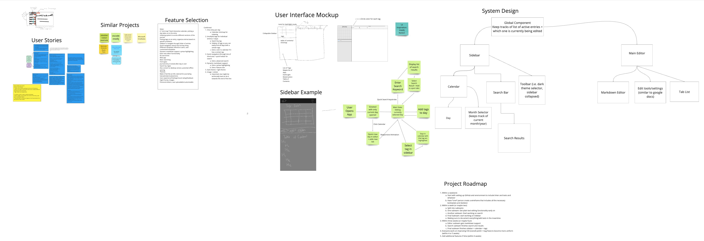
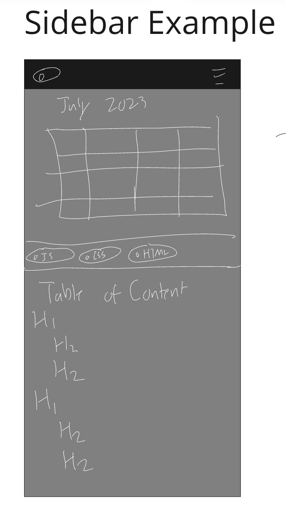
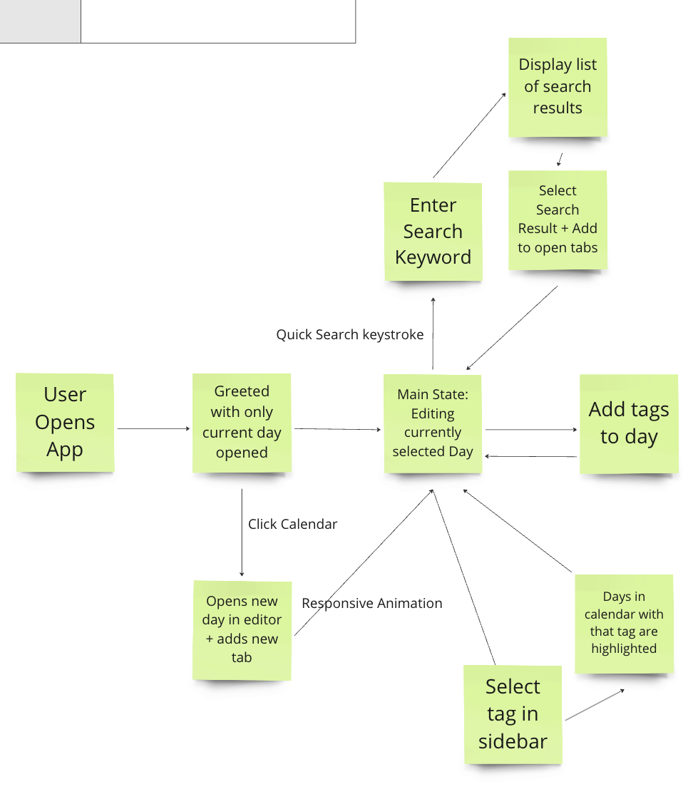

# Team 26 Project Pitch

## Synopsis

We plan to make a journal that is tailored to developers and solves various of the problems. We aim to make the application familiar to what they already know, yet specialized for the task for journaling.

## Target Audience / User Stories

We have compiled a list of potential user stories detailing the requirements of our target audience. Note that we in fact have more on our Miro board than just this list; we are only selecting a few for our pitch.

Generic Developer
* I am a developer who wants to keep track of what I did in the past when encountering development mistakes so I can reference it in the future and avoid making the same mistakes.
* I am a developer that wants to keep track of my notes and past projects for different coding languages so I am able to refer to them when necessary.

Indie Developer
* I want to keep track of my development progress and document the challenges and solutions I found
* I want entry organization, progress tracking, and accessibility across devices

Freelancer - Use this to keep track of work for client
* Would like to use this to write documentation
* Likes markdown support
* Offline support
* Support for multiple projects
* Migrate files from other programs into this one

Mid-level Developer
* I am a team planner and would like to share a task list with my members
* I am a developer that is constantly on new projects and want to quickly reference past entries if there is a problem I have tackled before
* I want to see my relevant tasks right away
* I move around a lot want to reference my entries wherever
* I am a person that cares a lot abt aesthetics and want my journal to be aesthetically pleasing
  along w lots of customization options

Disgruntled Dev at mid size company:
* Doesn't like his job, doesn't like doing work
* Wants his journal to be very simple, and very quick to take notes. (No manual formatting, few steps to get to writing, and no requirement of learning how to use app. (More similar to google docs than to markdown)
* Wants to be able to share his journal with future employers. (because he hates his current job)

## Miro Board

Our Miro Board contains our collective work from the brainstorming activity, which overlaps largely with this pitch. It can be found [here](https://miro.com/app/board/uXjVKOyLfVk=/). An image has been included as well for convenience, but do not that that we do not have the paid tier so the image quality does not capture all the details.

## Features

We decided on our features by first listing out all the things users may potentially want in our application and then eliminating ones that we believe will be too difficult to perform in the specified time period.

- One journal entry per day
- Calendar minimap for indexing
- (multiple) tags for individual entries (= days)
    - Search by tag
    - Sidebar of tags so you can easily find all days with a certain tags
    - Extra: color to each calendar day if it has a certain tag
- Quick navigation (through lots of shortcuts) + quick hotbar for search
    - Extra: advanced search
- Dynamic markdown support
    -Extra: code syntax highlighting
    -Extra: feature size
- Dark theme + light theme
- Image + sticker
    - Important, but might be technically hard so do it towards the end of the line

## Scope

We made sure to make our application contain features that will allow it to be actually useful, yet also technologically feasible. For instance, in our markdown support, we are first making sure the user can write plain text, then afterwards include basic markdown editing capabilities, and then finally will consider adding images and code syntax highlighting. Likewise, we are first targetting very basic search, and then may look into more advanced forms in the future. We have ordered features by priority and made sure to include the crucial aspects towards the beginning of our timeline.

Overall, we believe we have chosen a scope that matches exactly what we deliver for the specified time period.

## Interface and System Design

We have created a few fat marker sketches as well as detailed designes of our interface.

Here is more concrete vision of what we want our product to look like.

Here is a flowchart depicting how a user may interact with our application.

We have also created a rough system diagram highlighting the high level components of our application.

## Rabbit Holes / Risk Analysis

Our biggest rabbit hole right now that we are worried about is what to do with the left sidebar. We have a couple of ideas, but all of them don't seem optimal. It could theoretically happen that we spend too much time figuring out what to do with it. To help reduce this risk, we have decided that we are just going to stick with whatever we feels work best, and then only revisit issues like this at the very end when there is time remaining.

Another risk is the possibility of integration issues. We are planning to work on different subteams on the different components, so it may happen that actually integrating the different components together may pose an issue. To help resolve this, we plan to have one person actually create the boilerplate at the very start so that integration is taken care of immediately. This worked quite well for us in the warmup, so we believe it will work again.

## Technology Choices
We are confident that we can do our project in vanilla html/css/js. The only part that may be tricky is markdwon editor, but we believe based on our limitations this too should be possible. 

We also are considering making an Electron app instead of just a web site, but we will start off with a web site and pivot to a desktop application only later on if we feel the switch would make sense. The advantage of electron would be that we can include things such as Git, can better provide offline support to our users who require it, as well as get past the 10mb local storage limit.

## Timeline

This is the rough timeline we came up with in our brainstorming activity. We believe it should be feasible, but we did include wiggle room in case anything takes longer than expected.

1. Within a weekend:
    - Start with setting up GitHub and environment to include linter and tests and whatever
    - Have *one* person create a wireframe that includes all the necessary boilerplate and skeleton
2. Within a week (or maybe two):
    - Split into subteams
    - One subteam: Get plain text editing functionality early on
    - Another subteam: Start working on search
    - Final Subteam: start working on Sidebar
    - Making sure to document everything/add tests in the meantime
3. Within three weeks (or maybe four):
    - Editor subteam gets markdown support
    - Search subteam finishes search and results
    - Final subteam finishes sidebar + calendar + tags
4. Everyone work on improving CSS (overall polish + bug fixes) to become more uniform (within 4 or 5 weeks)
5. Add additional features if time (within 6 weeks)

## Additional Aspects

We also came up with a list of coding and git related conventions that we want to follow to make our development as streamlined as possible.

1. HTML, CSS, JS
    - Tab size: 4 spaces
    - Lines less than 100 characters
    - pascalCase
    - Styling extension???
    - Same line curly braces
    - Empty lines up to preference
    - Every function is documented, summary for complex files with additional comments for complex logic, present tense
    - Include examples in comments for complex functions
    - Code is as self-documented as possible
    - Avoid hard-coded values
2. Git
    - Feature branch for every feature, merge that into staging/development branch, approved by someone other than you
    - Merging into main requiring two approvals
    - Commit early and often, every commit does one thing
    - Commit messages should mention what the commit is for, then add details in description/body, present tense
    - Make github issues for every single thing we do

